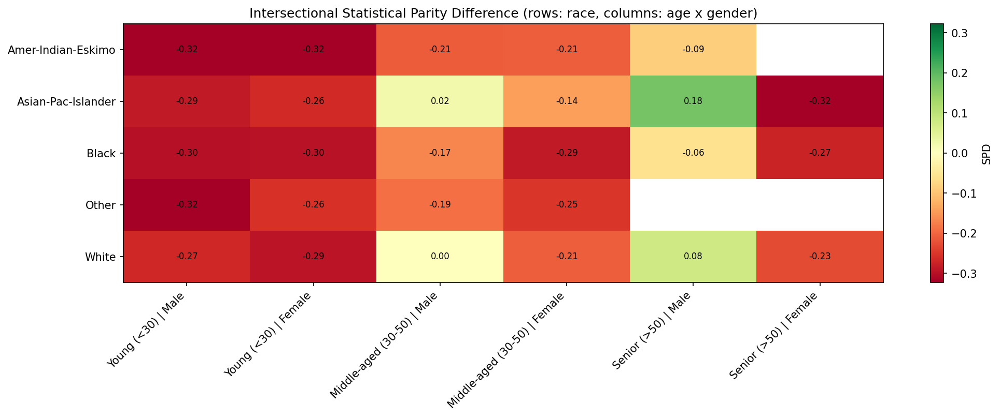
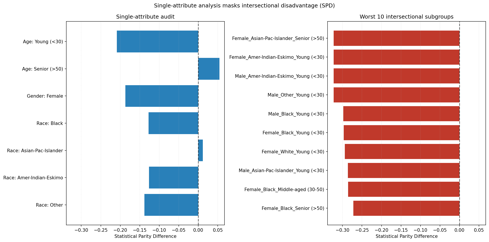

# Intersectional Bias Audit — UCI Adult Income Prediction

Companion code for **_Intersectional Disparities in ML: A 29-Group Fairness Analysis of UCI Adult
Income Prediction_** (Sarthak Doshi, Acropolis Institute of Technology and Research, Indore).

A single-attribute fairness audit asks "is this model fair to women?" and "is it fair to Black
applicants?". This one asks "is it fair to *young Black women*?" — and finds that the answer is very
different. The audit trains an income classifier on the UCI Adult census dataset, then scores every
populated `Gender × Race × Age` subgroup against the `Male_White_Middle-aged (30-50)` baseline using
Statistical Parity Difference (SPD), Disparate Impact Ratio (DIR), Equal Opportunity Difference
(EOD) and the FPR/FNR gaps.

The paper is included as [`Paper.pdf`](Paper.pdf).

## Headline result

From the run committed in [`results/`](results/) (logistic regression, 30% held-out split, seed 42):

| | |
|---|---|
| Model accuracy / ROC AUC | 0.847 / 0.904 |
| Populated intersectional subgroups | 30 |
| Subgroups large enough to score (n ≥ 10) | 27 |
| **Subgroups breaching the four-fifths rule** | **22 of 27 (81%)** |
| Worst DIR | `Male_Other_Young (<30)` = 0.000 |
| Worst SPD | `Male_Other_Young (<30)` = −0.322 |
| Privileged baseline selection rate | 0.322 |

The masking effect the paper argues for, measured on the same predictions:

| Attribute | Worst *single-attribute* SPD | Worst SPD inside that group | Hidden gap |
|---|---|---|---|
| Race | −0.138 (`Other`) | −0.322 (`Male_Other_Young (<30)`) | **0.184** |
| Gender | −0.187 (`Female`) | −0.322 (`Female_Amer-Indian-Eskimo_Young (<30)`) | **0.136** |
| Age | −0.209 (`Young (<30)`) | −0.322 (`Male_Other_Young (<30)`) | **0.114** |

A conventional gender audit reports a −0.19 parity gap. The worst-off subgroup of women sits at
−0.32 — nearly twice as bad, and invisible to that audit.





## Install

```bash
git clone https://github.com/SdSarthak/intersectional-bias-audit.git
cd intersectional-bias-audit

python -m venv venv
source venv/bin/activate        # Windows: venv\Scripts\activate

pip install -r requirements.txt          # runtime
pip install -r requirements-dev.txt      # + pytest
```

Python 3.9+.

## Getting the data

The dataset is **not** in this repository. On the first run it is downloaded automatically via
`ucimlrepo` and cached to `data/adult.csv`; every later run reads the cache and needs no network.

To fetch it manually instead — for an offline machine, or if the UCI API is down:

1. Download <https://archive.ics.uci.edu/static/public/2/adult.zip>
2. Unzip it and put `adult.data` into `./data/`

The loader accepts the raw headerless `adult.data` format directly. Point it elsewhere with
`BIAS_AUDIT_DATA_DIR` (see [`.env.example`](.env.example)).

## Usage

```bash
python main.py                     # full audit: tables, figures, report
python main.py --tradeoff          # also sweep regularization strength
python main.py --no-figures        # tables and report only
```

Equivalently, and with more control:

```bash
python -m bias_audit.cli audit --min-group-size 25 --random-state 7
python -m bias_audit.cli report                 # rebuild the report from a saved CSV
python -m bias_audit.cli figures                # re-render figures from a saved CSV
python -m bias_audit.cli audit --help
```

As a library:

```python
from bias_audit import run_audit, build_report

run = run_audit()
print(build_report(run.audit, run.model.performance, run.masking))

run.audit.worst("dir", k=10)      # most disadvantaged subgroups
run.audit.failing_four_fifths()   # everything below the 0.8 legal floor
run.audit.reliable("eod")         # subgroups with enough positives to trust EOD
```

Scoring predictions from *your own* model needs no retraining:

```python
import pandas as pd
from bias_audit import audit_intersectional, build_group_labels

protected = pd.DataFrame({"sex": ..., "race": ..., "age_group": ...})
audit = audit_intersectional(y_true, y_pred, build_group_labels(protected))
```

## Outputs

Written to `results/` (override with `BIAS_AUDIT_RESULTS_DIR`):

| File | Contents |
|---|---|
| `intersectional_results.csv` | One row per subgroup: sizes, selection rate, SPD/DIR/EOD/AOD/FPR/FNR, verdicts, reliability flags |
| `single_attribute_results.csv` | The conventional per-attribute audit, same predictions |
| `masking_summary.csv` | Single-attribute vs intersectional worst case, per attribute |
| `model_performance.csv` | Accuracy, precision, recall, F1, ROC AUC |
| `fairness_accuracy_tradeoff.csv` | Metrics across the regularization grid (`--tradeoff`) |
| `audit_report.txt` | The full written report |
| `figures/*.png` | Heatmaps, rankings, sample-size scatter, trade-off curve |

## How the metrics are defined

Every metric compares an unprivileged subgroup to the privileged baseline as
`unprivileged − privileged` (or `unprivileged ÷ privileged` for DIR), matching AIF360's convention,
so a negative value means the subgroup is worse off.

| Metric | Definition | Ideal | Threshold |
|---|---|---|---|
| SPD | `P(ŷ=1 \| unpriv) − P(ŷ=1 \| priv)` | 0 | \|SPD\| ≤ 0.1 |
| DIR | `P(ŷ=1 \| unpriv) ÷ P(ŷ=1 \| priv)` | 1.0 | ≥ 0.8 (four-fifths rule) |
| EOD | `TPR(unpriv) − TPR(priv)` | 0 | \|EOD\| ≤ 0.1 |
| AOD | mean of the TPR and FPR gaps | 0 | \|AOD\| ≤ 0.1 |
| FPR / FNR gap | difference in the respective error rate | 0 | ≤ 0.1 |

They are implemented in plain NumPy in [`bias_audit/metrics.py`](bias_audit/metrics.py) rather than
called from AIF360. AIF360 remains the reference for the *definitions*, but its optional extras pull
in a large dependency tree and its metric signatures have shifted across releases — which is exactly
why the original notebook silently produced empty FNR/FPR columns. Implementing them directly makes
each one unit-testable against hand-computed confusion matrices with no dataset download.

**Two guards on trusting a number.** A subgroup below `min_group_size` (default 10) is reported with
NaN metrics and a `small_sample` note — listed, because its existence is itself a finding, but never
quoted. Separately, EOD and the FNR/FPR gaps are conditioned on a subgroup's positive or negative
rows, which can be a handful even in a large subgroup; those rows carry `eod_reliable` /
`fpr_reliable` flags and the report's headline figures use only the reliable ones. In this dataset
`Female_Black_Young (<30)` has 197 test rows but just 3 with true income >50K, so its TPR of 1.00 is
noise, not fairness.

## Layout

```
bias_audit/
  config.py          bin edges, baselines, thresholds, paths — all overridable
  data.py            download/cache, cleaning, split, encoding
  model.py           logistic regression + performance metrics
  metrics.py         the fairness metrics, in NumPy
  intersectional.py  subgroup audit, single-attribute audit, masking analysis
  plots.py           figures
  report.py          the written report
  pipeline.py        end-to-end run + result persistence
  cli.py             command line interface
notebooks/           the original Colab notebooks (outputs stripped)
tests/               52 tests, no network or dataset needed
results/             committed output of the run described above
```

## Tests

```bash
python -m pytest
```

52 tests, ~9 seconds, no downloads. `tests/conftest.py` generates a synthetic Adult-shaped frame —
same columns, same `?` missing markers, with a deliberately disadvantaged `Female_Black_Young`
subgroup — so the whole pipeline is exercised offline. The metric tests check against confusion
matrices computed by hand, and `test_single_attribute_analysis_masks_the_intersectional_gap`
reproduces the paper's central claim on controlled data.

## Notes on reproducing the paper

* The paper reports **29** populated subgroups; this run finds **30**. The difference is an
  age-binning fix: `pandas.cut` closes intervals on the right, so the original edges
  `[0, 30, 50, 150]` put every 30-year-old in the `Young (<30)` band, contradicting the band's own
  label. The edges are now `[0, 29, 50, 150]`, giving `<30 / 30–50 / >50` as written.
* The paper's baseline selection rate was 0.11, versus 0.32 here. The notebook rebuilt its
  protected-attribute arrays by hand after several `reset_index` calls, and the demographics drifted
  out of alignment with the predictions. `prepare_data` now carries the protected attributes through
  the split alongside the feature matrix, so they cannot separate. The qualitative conclusions are
  unchanged and in fact stronger: 22 of 27 subgroups breach the four-fifths rule.
* The notebook's plotting cells fell back to invented constants
  (`locals().get('spd_gender', 0.05)`) and `np.random.choice` demographics whenever a variable was
  missing, so several rendered charts did not describe the model being audited. Nothing in
  `plots.py` fabricates data; a missing value stays missing.
* `fnlwgt` (a census sampling weight, not an attribute of the person) is dropped by default. Set
  `AuditConfig.drop_columns = ()` to keep it.

## Citation

```bibtex
@article{doshi2025intersectional,
  title   = {Intersectional Disparities in ML: A 29-Group Fairness Analysis of
             UCI Adult Income Prediction},
  author  = {Doshi, Sarthak},
  year    = {2025},
  note    = {Acropolis Institute of Technology and Research, Indore, India}
}
```

Dataset: Becker, B. and Kohavi, R. (1996). *Adult*. UCI Machine Learning Repository.
<https://doi.org/10.24432/C5XW20>
